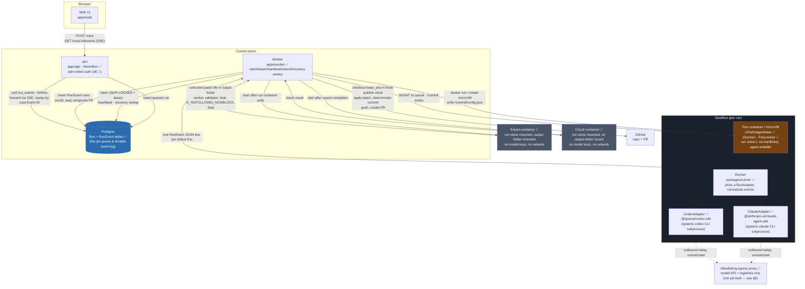
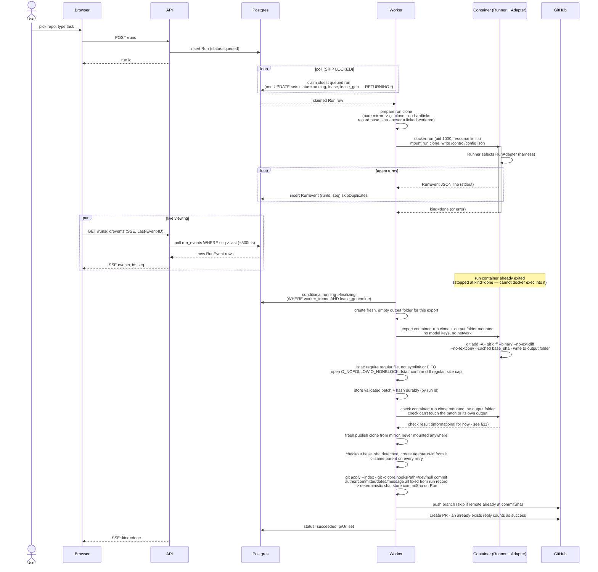
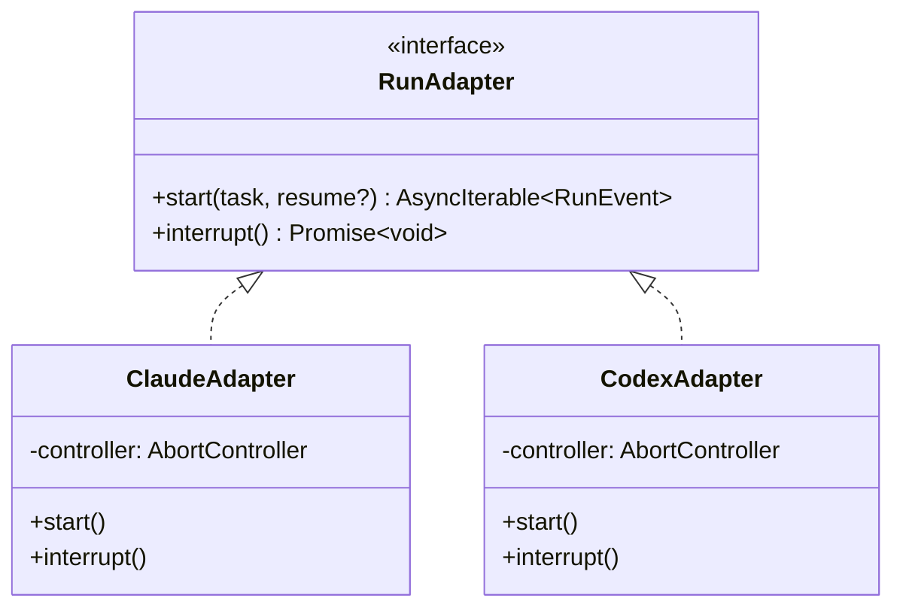
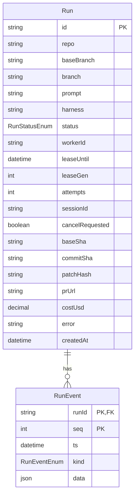

# Cloud Agents — Architecture

A hosted platform where a user signs in with GitHub, picks a repo, and hands a task to a coding
agent. The agent runs in an isolated sandbox in the cloud and keeps going after the user closes
their laptop. Output is a branch and a pull request. The platform is **harness-agnostic**: any
coding agent (Claude Code, Codex, Gemini CLI, and others) can run inside it, unmodified, behind
the same contracts.

Status legend used throughout: ✅ built & tested · 🚧 designed, not yet built.

---

## 1. Design principles

These are the decisions everything else in this document follows from.

1. **Harness-agnostic from day one.** Nothing outside the sandbox knows which coding agent is
   inside. This is enforced by two interfaces, not by convention: `RunAdapter` (inside the
   sandbox, one implementation per harness) and `Sandbox` (on the worker, one implementation per
   isolation backend). Adding a third harness or a second isolation backend should never require
   touching code that isn't that harness's or backend's own file.
2. **Postgres is the job queue.** `FOR UPDATE SKIP LOCKED` gives safe concurrent claiming without
   a separate broker. No Redis, no SQS, until it's *measured* to be insufficient — Postgres-as-queue
   is a well-worn pattern (Oban, River, GoodJob), not a shortcut.
3. **The sandbox is unreachable from the outside.** No browser, no API request, ever talks to a
   running container or microVM directly — the worker is the sandbox's only peer, and the API and
   worker themselves only communicate through Postgres, never directly. This is what makes worker
   crashes non-catastrophic, and what keeps the sandbox's attack surface to one controlled egress
   path instead of an open inbound one.
4. **Docker now, Firecracker later.** Hardened Docker containers get the whole system working
   end-to-end first. A `Sandbox` interface means swapping in Firecracker microVMs (dedicated
   kernel, snapshot/restore, near-zero idle cost) later doesn't touch the worker's run-management
   logic.
5. **Backend first.** No web UI until the run lifecycle — queue, sandbox, event log, replay,
   crash recovery — is solid by hand-testing with `docker run` and a CLI worker.

---

## 2. System diagram



**Read this diagram as three planes:**

- **Client** — the only thing a user's browser ever talks to is the API, over plain HTTP and SSE.
- **Control plane** — API, worker, and Postgres. Postgres sits *between* API and worker; they
  never call each other directly. This is deliberate (see §4).
- **Sandbox** — one run container (later: microVM) per run, fully isolated, reachable only by the
  worker, followed by two separate finalize containers — export, then check — neither with model
  keys or network. Today the run container's outbound path is unrestricted (§8); the allowlisting
  proxy that narrows it to one controlled egress path is designed but not yet built.

---

## 3. Run lifecycle (sequence)



**Cancellation** follows the same DB-mediated path in reverse: `POST /runs/:id/cancel` sets
`cancelRequested` on the row → the worker (already polling/heartbeating that run) notices the flag
→ sends **SIGINT** (not SIGTERM — SIGTERM leaves the agent's turn unfinished) to the container →
the runner's signal handler calls the active adapter's `interrupt()`, which aborts the in-flight
SDK call or subprocess. A cancel that lands mid-finalize doesn't abort finalize outright: the
export and check steps still run against whatever the agent had written when it was interrupted,
and the patch is still stored — a cancelled run's partial work isn't silently thrown away. What it
skips is opening a PR; the run ends `cancelled` with a stored patch available, not `succeeded` with
a branch pushed the user never asked to land.

**Crash recovery**, every ~30s: the worker sweeps *both* `running` **and** `finalizing` rows with
an expired lease — not just `running`. A worker that dies mid-push would otherwise leave a run
stuck in `finalizing` forever, since nothing else was watching it. The worker keeps heartbeating
throughout finalize, not just while the agent is running, so the sweep's expiry check stays
meaningful there too. Every finalize step is written to be safe to run twice (§11), so a recovered
run re-running an already-completed step — re-pushing the same commit, re-attempting a PR create —
is a no-op, not a duplicate.

For `running` rows: still running → take over. Finalize steps are all conditional on
`(worker_id, lease_gen)` matching the claiming worker (§11), so a worker that wasn't really dead —
just slow, or briefly lost its DB connection — can't finalize the same run twice alongside whoever
took over its lease; fencing protects the database writes, not any GitHub call already in flight,
which is exactly why the GitHub side effects themselves need to be idempotent (§11). Exited →
finalize normally. Gone entirely → requeue with `RESUME_SESSION` (if the harness's session
directory was mounted from the host — see §10) or mark failed, up to a bounded `attempts` count so
a run that reliably crashes the worker doesn't requeue forever.

---

## 4. Why Postgres sits between every hop

The single most load-bearing design choice in this system: **the browser never talks to the
sandbox, and the worker never talks to the API.** Every value crossing a boundary — a queued task,
a log line, a cancel request — is written to Postgres and read back out, never passed directly
between processes.

This buys three things at once:

- **Worker crashes are invisible to the browser.** The browser's `EventSource` just keeps polling
  `GET /runs/:id/events`; it has no idea whether the worker process that produced those rows is
  the one still running or a replacement that took over the lease five seconds ago.
- **Replay is free.** `RunEvent`'s composite primary key `(runId, seq)` plus `skipDuplicates: true`
  on insert means re-reading a container's full stdout history after a crash is *idempotent* — no
  special "resume from where I left off" logic needed, duplicates just no-op.
- **`EventSource` resume is free too.** The browser's native reconnect behavior resends
  `Last-Event-ID` automatically; the SSE endpoint just answers "everything with `seq >` that" from
  Postgres. No custom reconnect protocol was written for this — it's the platform default,
  because the durable log already existed for an unrelated reason (crash recovery).

## 5. Why SSE, not WebSockets

- The browser only ever needs data flowing **one direction** (server → browser). User actions
  (cancel, approve) are separate `POST` requests, not messages over the same channel — so the
  bidirectional half of a WebSocket buys nothing here.
- `EventSource`'s automatic reconnect-with-`Last-Event-ID` is exactly the resume primitive this
  system needs, built into the browser, for free. A WebSocket has no equivalent — reconnect/replay
  would have to be hand-rolled.
- SSE is plain HTTP. It survives proxies and load balancers that sometimes mishandle WebSocket
  upgrades, and `Bun.serve()` can stream it with no extra library.

## 6. Why Postgres as the job queue (not Redis/SQS)

`claim` is one `UPDATE ... WHERE id = (SELECT ... FOR UPDATE SKIP LOCKED LIMIT 1) RETURNING *`
statement. Multiple worker processes can run this concurrently against the same table with no
double-claim race, no separate broker to operate, and no second source of truth to keep in sync
with the `Run` row it's already reading. This is a deliberately deferred decision — Postgres's
`LISTEN/NOTIFY` is the next step if polling ever isn't enough, before reaching for Redis, since it
keeps the "Postgres between every hop" principle intact.

## 7. Harness-agnostic in practice

Built and tested so far: two adapters satisfying the exact same `RunAdapter` interface
(`packages/runner/src/adapter.ts`):



Both adapters spawn a native CLI binary as a subprocess — neither is a pure in-process library
call. The SDK manages that subprocess internally either way, though: `ClaudeAdapter` gets a
`Query` that extends `AsyncGenerator<SDKMessage>` directly, and `CodexAdapter` gets
`{ events: AsyncGenerator<ThreadEvent> }` from `runStreamed()` — the same shape of thing at the
point the adapter code touches it. What actually differs between the two is the **event
vocabulary**: Claude streams messages built from Anthropic Messages API content blocks (`text`,
`tool_use`, `tool_result`); Codex reports a thread/turn/item lifecycle (`thread.started`,
`item.completed` with an item `type` of its own). Both get mapped, by a pure function per adapter
(`mapClaudeMessage`,
`mapCodexEvent` — both `bun test`-covered with fixture data, no live calls needed to verify the
mapping logic), onto the same normalized `RunEvent` shape from `packages/shared`:

```
kind: status | text | tool_call | tool_result | raw | error | done
```

Nothing downstream of the runner — not the worker, not the API, not the UI — ever needs to know
whether a given run is Claude Code or Codex under the hood. That said, two same-shaped native CLI
adapters likely understate how different a *third* harness could look — an ACP-based adapter
(Gemini CLI, or Claude/Codex via their ACP bridges) is a two-way protocol where the agent itself
sends requests the client must answer (e.g. permission prompts), not a one-way event stream. That
will exercise `RunAdapter` harder than either adapter built so far (see the `send()` gap below).

## 8. Security boundaries

### Enforced today

- **GitHub credentials never enter the sandbox.** The worker does all git operations (commit,
  push, PR) itself using short-lived GitHub App installation tokens, from the host — outside the
  container, and (per §11 below) outside any directory the agent could have written into.
- **`Bash(git push *)` is disallowed in `ClaudeAdapter`'s tool policy** — belt-and-suspenders only.
  With no GitHub credentials in the sandbox and the agent's clone never configured with a real
  GitHub remote (§11), a push from inside the sandbox has no path to succeed regardless of tool
  policy. The actual guarantee is "no credentials in the sandbox," not this rule, so it isn't worth
  replicating into `CodexAdapter` as a platform-wide requirement.
- **Non-root by construction.** The base image runs as uid 1000 (`infra/images/base/Dockerfile`,
  built on the official Node image's built-in `node` user), and the worker launches every
  container as its own uid (`sandboxUser()`), so the sandbox can write the workspace the worker
  created. The installer makes that uid 1000; the worker refuses to start a sandbox as root.
- **The sandbox sees only the runner, never the install dir.** The worker runs from `/opt/cloudly`,
  whose `.env` holds the master key, the database URL and the setup token. Run containers get an
  explicit read-only allowlist instead (`RUNNER_MOUNTS` in `apps/worker/src/docker.ts`: root
  `package.json` and `node_modules`, `packages/shared`, and the runner's `src`, manifest and
  `node_modules`). Until this was fixed the whole install dir was mounted at `/repo`, and an agent
  could read the master key; with bring-your-own Postgres, that plus the reachable database
  would have exposed every stored secret, including the GitHub App private key.
- **Resource and privilege limits on every container** (`SANDBOX_LIMITS`): `--memory` (host RAM
  minus 768 MB, at least 512 MB, or `SANDBOX_MEMORY`), `--pids-limit 2048`, `--cap-drop ALL`,
  `no-new-privileges`. Memory is the one that matters most: without it a runaway build could
  take Postgres and the worker down with it on a 1 GB VM.
- **Model keys stay off command lines.** They're passed as `-e NAME` with the value in the docker
  client's environment, so they don't appear in the host's process list (`/proc/*/cmdline` is
  world-readable). They're still in the container's environment, and `docker inspect` shows them
  to anyone with Docker access, who is root anyway.
- **Only the worker can reach Docker.** The docker group is root-equivalent, so only the worker's
  user (uid 1000) is in it. The API and web app, the internet-facing processes, run as a separate
  `cloudly-app` system user with no Docker access; `.env` is `0640`, readable by the API through
  its group and by no one else. The web app gets no `.env` at all (it needs nothing at runtime,
  and `next build` would copy one into its standalone output). Every unit sets `NoNewPrivileges`.

### Planned, not yet built

- **Model API keys currently DO enter the sandbox.** `ANTHROPIC_API_KEY` (and the equivalent for
  Codex) has to reach the container as an env var for the SDKs to function, and the container has
  open internet. Combined with an agent that reads an untrusted repo's contents (including its
  README), this is a real prompt-injection-to-key-exfiltration path today, not a closed one.
  Nearest fix, and the right-sized one for what's actually needed right now: an internal Docker
  network plus a small allowlisting proxy (model API + package registries only) — about a day of
  work, closes the exfiltration path without needing key injection or cost metering yet. Pair it
  with a separate, low-spend-limit API key used only for sandbox runs, if the provider supports
  that, as defense in depth. LiteLLM is still the endgame for key injection (so the raw key never
  enters the container at all) and per-run cost metering, but that's a bigger lift than the
  exfiltration fix alone needs — don't reach for it before the smaller fix is in place.
- **The container's uid is the worker's host uid** (1000 on installs). The worker's user owns
  the workspace, so the sandbox uses the same uid to write it. That only matters after a container escape, which would land as
  the docker-group user. Fix: user-namespace remapping or rootless Docker, with workspace
  ownership mapped accordingly.
- **One-way egress only.** Once the allowlisting proxy above exists, the sandbox's outbound network
  routes through it exclusively, and nothing external has an inbound path to a running sandbox.
- **A repo's own `.mcp.json`/`.claude/settings.json` are untrusted by default** — `strict_mcp_config`
  and explicit `setting_sources` prevent a malicious repo from smuggling in hooks or MCP servers
  the platform didn't choose. Not yet wired up.
- **Invite-only** while the Docker backend is the only isolation option; public sign-up is gated
  behind the microVM backend landing first.

## 9. Data model



`RunEvent`'s primary key is the **composite** `(runId, seq)` — not an auto-increment id. That
single choice is what makes crash-recovery replay idempotent: re-inserting an event the worker
already wrote just violates the PK / gets skipped by `skipDuplicates: true`, instead of creating a
duplicate row.

`Run.baseSha`, `commitSha`, and `patchHash` exist for the same reason, one layer up (§11):
`baseSha` is recorded once, at clone time, and is what the agent's changes always get diffed
against — never a branch name or ref inside the agent's own repo, which the agent can move.
`commitSha` is computed once finalize builds a deterministic commit, and is what a retried
finalize checks before pushing again — if the remote branch already points at it, the push is
skipped rather than reattempted. `patchHash` lets a retry work from the already-validated, durably
stored patch instead of re-deriving it from a workspace or container that may no longer exist.

`kind` is currently a native Postgres enum (`RunEventEnum`), mirroring the Zod enum in
`packages/shared`. Open question, not yet decided: every new event kind then requires a migration
that must land before any runner build can emit it — plain `text` validated by Zod at the
application layer would avoid that coupling, at the cost of losing the DB-level `CHECK` guarantee.
Revisit if the event-kind list needs to grow faster than migrations comfortably allow.

## 10. Known gaps and accepted trade-offs

What's fixed in the design above (§11 has the mechanism for each), and what's still open — see
§13 for how this list came to look the way it does.

**Fixed in this design already:**
- Finalize (check, patch export) always runs inside fresh, network-less containers — never on the
  host, and never as a `docker exec` into an already-stopped run container.
- Each run gets a standalone clone (`--no-hardlinks`), not a linked worktree — git actually works
  inside the sandbox, and the clone shares no on-disk state with the shared mirror.
- The host never runs git inside anything the agent could have written to. The run clone (mounted,
  agent-writable) and the publish clone (host-only, never mounted, created fresh at finalize) are
  two different directories; only the publish clone ever has a commit applied and pushed from it.
- The export diffs against a pinned `base_sha`, never a mutable ref inside the agent's own repo,
  using `--no-ext-diff --no-textconv` so agent-controlled diff/textconv config can't corrupt it.
- The patch is read defensively — `lstat` requiring a regular file (not a symlink *or* a FIFO,
  which a bare `O_NOFOLLOW` wouldn't catch and which can hang an open with no writer), then
  `O_NOFOLLOW | O_NONBLOCK`, then `fstat` to close the race — plus a size cap and no `.git/` paths.
  It's stored durably by run id as soon as it's validated.
- The check command runs *after* the patch is already captured, in its own container with no
  mount to the output folder — it can neither pollute the diff with its own side effects nor
  tamper with a patch it has no path to. (Its lack of network access is a known, currently
  accepted limitation — see §11.)
- The publish clone explicitly checks out `base_sha` before applying anything, rather than
  whatever the mirror's default branch currently is — the patch might not even apply otherwise,
  and the commit's parent would differ between retries.
- The commit finalize creates is fully deterministic (fixed author, committer, dates, *and*
  message, all from the run record), so a retried finalize reproduces the same SHA and a repeat
  push is a genuine no-op, checked against `Run.commitSha` before it's even attempted.
- PR creation has no check-then-act step — it attempts create and treats GitHub's own
  already-exists reply as success.
- The recovery sweep covers `finalizing`, not just `running`, and the worker heartbeats through
  finalize so that coverage stays meaningful.
- A cancel mid-finalize keeps the exported/stored patch and skips only the PR — partial work isn't
  discarded.
- Model API keys' current in-sandbox exposure is stated plainly in §8, with a right-sized near-term
  fix (allowlisting proxy) instead of reaching straight for LiteLLM.

**Still open, tracked here rather than silently deferred:**
- **`RunAdapter` needs a `send(cmd)` method.** The `Sandbox` interface already has
  `send(h, cmd): Promise<void>` for message/cancel/approve/deny, but nothing inside the sandbox
  can currently *receive* those — `RunAdapter` only has `start`/`interrupt`. Mid-run messages,
  approvals, and (eventually) ACP permission requests all need this path. Cheap to add now, while
  only two adapters exist to update; expensive to retrofit once more do.
- **Recovery redoes a run from scratch rather than resuming it — by design, not yet by gap.**
  Built (`apps/worker/src/recovery.ts`): the sweep reclaims `running`/`finalizing` rows with an
  expired lease (its own `SKIP LOCKED` query, bumping `leaseGen` and `attempts`), removes any
  leftover container, clears the dead attempt's partial `RunEvent` rows, and hands the run to
  `processRun` for a fresh agent invocation — proven live, including that the stale event log is
  genuinely wiped before the retry. This sidesteps the original `docker logs`-survival concern
  entirely (recovery never reads container logs at all), but trades away the dead attempt's partial
  history and pays for a whole new agent turn on every recovery, rather than continuing the old
  one. Runs out of retries → `failExhaustedRuns` marks it permanently `failed` instead of looping
  forever. True log-based resume (host-mounted event file, `Sandbox.events(h, fromSeq)`) remains
  the real fix if redo-from-scratch turns out to be too expensive in practice — not built.
- **Session directories must be mounted from the host.** Claude Code keeps sessions in
  `~/.claude`, Codex in `~/.codex`, both inside the container by default. If the container is
  gone, `RESUME_SESSION` has nothing to resume from. Mount a per-run home directory from the host
  so sessions survive container loss.
- **The runner shouldn't run as PID 1 unsupervised.** PID 1 in a container is responsible for
  reaping exited child processes; Node/Bun don't do this automatically, so shells or dev servers
  the agent spawns pile up as zombies over a long run. Launch containers with `--init` (tini), and
  have the worker send SIGKILL after a grace period if SIGINT doesn't stop the runner.
- **SSE auth (fixed).** Sign-in is now a GitHub OAuth session cookie, which `EventSource` sends,
  so the live stream works from the browser. A second SSE trap surfaced while wiring it: any gzip
  layer in front (Next's rewrite proxy here, a CDN in general) buffered the stream until it ended,
  so the browser saw nothing. The stream now sends `Cache-Control: no-cache, no-transform` and
  `X-Accel-Buffering: no`; verified with a gzip-accepting client before and after.
**Fixed since, while building the API (`apps/api`):**
- **`AcpAdapter` didn't support `resume`.** `session/load` exists in the raw protocol but isn't
  wrapped by the fluent `SessionBuilder` convenience API the way `session/new` is. Fix: calls
  `session/load` directly, then hands its response (merged with the known `sessionId`, since
  `LoadSessionResponse` doesn't echo it back) to `attachSession` — the same private method
  `SessionBuilder.start()` itself uses internally to wire up an `ActiveSession`. `private` in the
  `.d.ts` is TS-only and erased at runtime, so this works, but it's relying on an internal that
  isn't a stable public contract — revisit if a future SDK version wraps `session/load` properly.
  Live-tested across two *separate* `gemini --acp` subprocesses — a fresh process resuming a session
  created by a different, already-exited one, the real shape of a worker recovery/redo: phase one
  told it a secret code, phase two (new subprocess, `session/load` with that session's id) correctly
  recalled it, proving history genuinely replays rather than the mock succeeding on its own say-so.
  One real finding along the way: `session/load` needs an explicit `authenticate` request first
  (`-32000 Authentication required` without it) even though `session/new` doesn't need one upfront —
  each run is a brand-new subprocess with no prior auth state, so `startResumedSession` always calls
  `authenticate` with `methodId: "gemini-api-key"` (the one credential path this harness supports)
  before `session/load`.
- **Run containers hung forever after a `gemini-acp` run finished, instead of exiting.**
  Live-tested the full worker → `docker run` → `AcpAdapter` → `gemini --acp` path end to end: the
  protocol mapping and handshake were correct (`initialize`, `session/new`, `session/prompt`,
  `session/update` all matched real responses, text arrived, `done` fired), but `docker run --rm`
  never returned — confirmed via `docker ps` showing the container still `Up` a full minute after
  the agent's turn completed. No orphaned subprocess (`pgrep` came up empty), so the hang was Bun's
  own process not exiting, not a leaked `gemini` process. Traced to `ndJsonStream`'s reader not fully
  releasing its handle back to Bun's event loop even after the ACP SDK's own `connectWith` →
  `runUntil` → `close()` correctly calls `reader.cancel()` on it — a Bun `Readable.toWeb()` gap, not
  an SDK or adapter logic bug. Fix: `packages/runner/src/index.ts`'s entrypoint now calls
  `process.exit(0)` after `main()` resolves, symmetric with the error path's existing `process.exit(1)`
  — correct anyway for a one-container-per-run process whose job is done once the loop drains.
  Re-tested the same real container run after the fix: completed in 16s, `docker run --rm` returned
  on its own, no container left behind.
- **`Bun.serve`'s idle timeout was cutting quiet SSE streams — reproduced live, then fixed.** A
  real test (insert events with multi-second gaps between them, watch the connection) showed
  `curl` dying with a partial-transfer error roughly 20+ seconds into a quiet stretch — confirming
  this predicted gap before it shipped. Fix: `GET /runs/:id/events` now writes an SSE comment line
  (`: ping\n\n`, ignored by `EventSource`, invisible to the client) on every poll tick that finds no
  new events, so the connection never goes quiet long enough to look idle. Re-tested through a full
  `status → text → done` sequence with real multi-second gaps: all events delivered live, keep-alive
  pings filled every gap, and the stream closed cleanly (`curl` exit code `0`) right after `done` —
  plus `Last-Event-ID` replay verified separately (reconnecting after `seq=1` correctly resumed
  from `seq=2` onward, not from the start).
- **Sessions: follow-up messages, and why they don't use the agents' own saved sessions.**
  A `Thread` holds many turns; each turn is a `Run` carrying `threadId`. All turns share one branch
  (`agent/thread-<id>`) and one PR: a turn's workspace starts from the thread's branch when an earlier
  turn pushed it (`createWorkspace(…, { branch, baseBranch })`; `baseBranch` used to be ignored),
  commits on top, pushes a fast-forward, and `createPullRequest`'s existing idempotency returns the same
  PR. Turns in a thread run one at a time (the claim query skips a queued turn while a sibling is
  `running`/`finalizing`). A turn that changes no files now succeeds without a commit instead of
  failing in `git apply`. **Memory:** the first design resumed each agent's own session
  (`agentSessionId`, a per-thread `HOME` mounted into the sandbox). Testing against real Gemini CLI
  showed that after one `session/load` it rewrites the session file with only its startup context, so
  a second resume reports "No previous sessions found" and the conversation is lost. Follow-ups
  therefore start a clean session with the earlier conversation written into the prompt
  (`transcript.ts`, last 8 turns, bounded), which is independent of any agent's storage. Native
  resume plumbing remains, off by default and never for Gemini
  (`CLOUDLY_NATIVE_RESUME=native-claude,native-codex`), and is **untested** (no Anthropic or OpenAI
  key on the dev machine). Also found: Gemini's default `auto` model router sends free-tier keys to
  models with a free limit of 0 or an exhausted daily quota, then retries for minutes (turns took 3–6
  minutes); pinning `gemini-3-flash-preview` through `session/set_model` brought a turn to ~30s. Failed
  runs now report the agent's own error event instead of the container's usually-empty stderr.
- **GitHub App auth, authenticated clone, push, and PR creation — built and live-tested against a
  real repo, including the full `processRun` pipeline producing a real PR end to end.**
  `apps/worker/src/github.ts` wraps `@octokit/auth-app` (RS256 JWT + installation-token exchange,
  with its own caching/refresh — not hand-rolled) for `authenticatedCloneUrl` and an idempotent
  `createPullRequest` (§11's "attempt create, treat GitHub's own already-exists reply as success"
  rule, verified against a real duplicate-call 422, not assumed). `resolveCloneSource` only engages
  GitHub auth when `run.repo` is a real `"owner/repo"` slug — anything else (every existing test
  fixture's local path) passes through unchanged, so no test needed updating. `finalize.ts` gained
  `pushBranch` (checks the remote branch via `git ls-remote` before pushing, skipping entirely if
  it's already at `commitSha`, per §11) and `openPullRequest`; `process-run.ts` calls both after
  `publishCommit`, gated the same way as clone resolution, with push always attempted but PR
  creation skipped on cancel (matching the pre-existing code comment above `exportPatch`, not a new
  decision). One real bug caught before any of this worked: `GITHUB_APP_INSTALLATION_ID` was
  pasted in as the full settings URL instead of the trailing numeric ID — `@octokit/auth-app`
  failed with a real, correctly-diagnosed runtime error, not a silent wrong value. Live-tested in
  stages — installation token, authenticated clone, push, `createPullRequest` including its
  duplicate-call idempotency path — then end to end: a full `processRun` against the real
  `AymanKhan9/Cloudly` repo produced an actual PR (#2) with the correct branch and title, closed
  and cleaned up afterward. Not yet built: user-facing GitHub login / repo picker — this covers the
  mechanics only, per an explicit scoping decision to build push+PR before any UX around it.

## 11. How finalize works

Finalize is the part of a run most exposed to code the platform doesn't trust: the repo's own
check command, and every file the agent touched. Nothing here treats that code as anything other
than untrusted input.

**Two clones, never one.** Workspace prep (§3) gives each run a **run clone** —
`git clone --no-hardlinks <mirror> <run-dir>`, mounted read-write into the sandbox, fully
agent-writable, and gone once the run's containers are cleaned up. Finalize creates a second,
unrelated **publish clone** — a fresh clone from the same mirror, made only at finalize time,
never mounted into any container, never touched by the agent. Every host-side git operation —
applying the patch, committing, pushing — happens only in the publish clone. The run clone is
data the worker reads a diff out of; the publish clone is the only place the worker ever runs git
against a directory it fully controls. Collapsing these into one clone is the same host-git hole
under a different name: whichever clone the agent could write into is not a safe place for the
host to run git, no matter how the patch got there.

A **linked worktree** doesn't work for the run clone, for an unrelated reason: its `.git` is a
*file* pointing at `<mirror>/worktrees/<name>`, and that mirror directory is never mounted into
the sandbox — every git command run inside it, including the agent's own `git diff`, would fail
immediately. `--no-hardlinks` on the clone matters too, separately: an ordinary local clone
hardlinks object files from the source instead of copying them, so the workspace-prep `chown` to
uid 1000 would flip the *mirror's own* object files to that owner as well (hardlinks share one
inode, so a `chown` on one path changes it for every path pointing at that inode) — silently
handing the agent write access to objects every other run's mirror depends on. `--no-hardlinks`
forces real copies, so the run clone shares no on-disk state with anything else.

**Export happens before the check runs, not after.** After the run container exits (it's already
stopped by the time finalize starts — there's nothing left to `docker exec` into), the worker
creates a fresh, empty output folder — new for this export, never reused — and starts an **export
container**: run clone and output folder mounted, no model keys, no network. Inside it:
`git add -A` then
`git diff --binary --no-ext-diff --no-textconv --cached base_sha`, written to the output folder.
`--no-ext-diff --no-textconv` matter because the run clone's git config and `.gitattributes` are
agent-controlled — an external diff driver or textconv filter configured there could turn the
export into something `git apply` can't use later; this isn't a security boundary, just what makes
the patch actually usable. `base_sha` is the commit the worker itself recorded when it made the
run clone — never a branch name or ref inside the agent's own repo, which the agent can move.
Running the check command *before* this point would let its side effects (test snapshots, build
artifacts) leak into the diff, and — since the check command is itself repo code the agent may
have edited — let it tamper with a patch that doesn't exist yet. Running it *after* export, in a
**separate check container** with the run clone mounted but no mount to the output folder at all,
closes both: the check literally has no path to the patch by the time it runs. The output folder
itself is mounted only into the export container, never the run container — the agent's main
process never gets a chance to plant anything there ahead of time.

**The patch is untrusted the moment it exists.** It came out of a container the agent had full
write access to, including the output folder itself — which means the agent could leave something
other than a plain file where the worker expects one. A symlink is the obvious case, but not the
only one: a **named pipe** (`mkfifo`) is just as easy to plant, and opening a FIFO for reading with
no writer on the other end blocks forever — `O_NOFOLLOW` alone stops symlink-following but does
nothing to stop that hang, since a FIFO isn't a symlink. The worker reads it in three steps
instead of one: `lstat` the path and require an actual regular file (rejecting symlinks, FIFOs,
devices, sockets outright); open with `O_NOFOLLOW | O_NONBLOCK`, so even a same-instant swap to a
FIFO can't block the open; then `fstat` the open file descriptor and check it's still the same
regular file the `lstat` saw, closing the race between the two checks. On top of that: a size cap,
and rejecting any patch content with a path under `.git/`. Once validated, the patch and its hash
are stored durably, keyed by run id — a retried finalize works from that stored patch, not from a
workspace or container that may no longer exist by the time recovery gets to it.

**The commit finalize creates is deterministic.** A fresh clone from the mirror starts wherever
the mirror's default branch currently is — not necessarily `base_sha` — so the publish clone
explicitly checks out `base_sha` (detached) and creates `agent/run-<id>` from that exact commit
before anything else happens. Skipping this step breaks two things at once: the patch might not
even apply if the base has moved since the run started, and the commit's parent would differ
between a first attempt and a retry, which breaks determinism just as much as a wrong timestamp
would. From there: `git apply --index` on the validated patch, then
`git -c core.hooksPath=/dev/null commit` with the author, committer, `GIT_AUTHOR_DATE`,
`GIT_COMMITTER_DATE`, and the commit message *all* fixed from the run record rather than left to
whatever `commit` would default to. Same parent, same tree, same metadata, same message always
produce the same SHA — so a finalize that runs twice (recovered after a crash, say) produces the
identical commit both times, not two different ones with the same content. That SHA is stored on
`Run.commitSha`; a retried finalize checks whether the remote branch already points at it and
skips the push entirely if so, rather than attempting a second push that would be rejected as
non-fast-forward.

**PR creation has no check-then-act step.** An expired DB lease doesn't mean the worker that held
it is actually dead — it may just have been slow, or briefly lost its DB connection — and a push
or PR-create request it already sent to GitHub can't be recalled once sent. `lease_gen` (a
generation number on `Run`, incremented on every claim, checked on every status transition and
finalize step) keeps two workers from racing on the database, but that says nothing about a
GitHub call already in flight — so the GitHub side effects are written to be idempotent on their
own terms instead. The branch name is fixed per run and the commit is deterministic, so pushing
twice is a genuine no-op; PR creation just attempts create and treats GitHub's own
already-exists reply as success, relying on GitHub's uniqueness guarantee rather than a client-side
check that could never really be atomic against another worker.

**The recovery sweep covers `finalizing`, not just `running`.** A worker that dies mid-push would
otherwise leave a run stranded in `finalizing` forever, invisible to a sweep that only watched
`running` rows. The worker heartbeats throughout finalize for exactly this reason, and every step
above is safe to repeat — a recovering worker re-running a step that already completed (already
pushed, already opened) is a no-op, not a duplicate action.

**Cancel mid-finalize keeps the work, skips the PR.** Export and check still run against whatever
the agent had produced when the cancel landed, and the patch is still stored — a cancelled run
ends with a stored patch available, not with its work silently discarded. What cancel skips is
opening the PR: the run ends `cancelled`, not `succeeded` with a branch pushed nobody asked to
land.

**The check container having no network is an open trade-off, not a settled one.** Plenty of real
repos' check commands need network access — fetching dependencies, hitting a mocked or live
service in a test. With no egress at all, those checks fail for reasons that have nothing to do
with whether the agent's work is any good, and nothing in this design yet distinguishes that from
a real failure. Two ways to resolve it, neither implemented: treat the check result as
informational only for now (surfaced to the user, not gating anything), or give the check
container the run's own environment-level egress allowlist once environments (§12) exist. Worker
v0 takes the first option by default, simply because the second doesn't exist yet to take.

**What this section claims is only as good as what's tested.** Every defense above is a design
description until it has a test proving it holds. The tests worker v0 ships alongside this
design, not after it:
- A patch file that's a symlink to a host path gets rejected, not followed.
- A patch file that's a named pipe gets rejected without the worker hanging.
- A run clone with `core.fsmonitor` set to an arbitrary command, taken through a full finalize,
  never executes that command on the host.
- Running finalize twice against the same stored patch produces the same commit SHA, and the
  second push is skipped rather than attempted.
- `kill -9` on the worker mid-run and mid-finalize, on a fresh restart: the run finishes with no
  duplicate `RunEvent`s, no duplicate pushes, no duplicate PRs.

## 12. Component status

| Component | Location | Status |
|---|---|---|
| Zod contracts (`RunEvent`, `RunStatus`, `HarnessManifest`) | `packages/shared` | ✅ |
| Prisma schema, migration, singleton client (incl. leaseGen/attempts/baseSha/commitSha/patchHash) | `packages/db` | ✅ |
| Base sandbox image (Debian, non-root uid 1000, bun/git/python3/codex CLI) | `infra/images/base` | ✅ |
| `RunAdapter` interface | `packages/runner/src/adapter.ts` | ✅ |
| Claude Code adapter | `packages/runner/src/adapters/claude.ts` | ✅ tested live |
| Codex adapter (API key via the SDK `apiKey` option, `approvalPolicy: "never"`) | `packages/runner/src/adapters/codex.ts` | ✅ tested live earlier; key-based auth not yet live-tested (no OpenAI key on the dev machine) |
| Runner entrypoint (config load, harness selection, stdout printing) | `packages/runner/src/index.ts` | ✅ tested live in-container |
| Worker v0 (no DB, `Bun.spawn` docker run, two-clone finalize per §11, print diff) | `apps/worker` | ✅ built, pending one live run with real credentials |
| Finalize security test suite (symlink, FIFO, fsmonitor, determinism — §11) | `apps/worker/tests/` | ✅ 15 tests passing |
| DB-backed worker (claim, heartbeat, cancel, event insertion, poll loop + semaphore, recovery sweep) | `apps/worker` | ✅ built and tested live |
| Crash-recovery test (`kill -9` mid-run/mid-finalize, no duplicate events) | `apps/worker/tests/recovery.test.ts` | ✅ (redo-from-scratch strategy — see §10) |
| API: `POST`/`GET /runs`, `GET /runs/:id` | `apps/api/src/index.ts` | ✅ built and tested live |
| API: `POST /runs/:id/cancel` | `apps/api/src/index.ts` | ✅ built and tested live |
| API: `GET /runs/:id/events` (SSE, replay via `Last-Event-ID`, keep-alive ping) | `apps/api/src/index.ts` | ✅ built and tested live |
| GitHub OAuth sign-in (PKCE, hashed session cookie, login allowlist), replacing dev-token auth | `apps/api` | ✅ tested live in a real browser |
| Spend limit: per-run cost capture, 80% warning + email, 100% hard stop | `apps/worker/src/{cost,budget}.ts`, `apps/api` | ✅ unit + live Postgres tests; tripped live by a real run. Cost is only known when a turn ends, so Claude runs get the month's remaining budget as the SDK's own `maxBudgetUsd` and stop themselves at the limit; Codex and Gemini turns can overshoot by one turn's cost. Failed Claude turns now count their cost too (before, an error result recorded $0) |
| Production worker entrypoint | `apps/worker/src/main.ts` | ✅ ran a real Gemini job end to end to PR #3 |
| Self-host installer (Docker, Bun, swap, Postgres, systemd, optional Caddy HTTPS) | `install.sh`, `deploy/` | 🚧 written and syntax-checked; downloads a prebuilt per-arch release (`.github/workflows/release.yml`) and falls back to building from source; the workflow and the download path have not run for real, and the installer has not run on a fresh VM |
| Web UI: landing, sign-in, settings (finish-reviewed); sessions sidebar, new-session page, chat view | `apps/web` | ✅ landing/sign-in/settings reviewed; chat UI built and checked in a browser, not independently reviewed |
| Sessions: a thread = many turns (runs) on one branch and one PR, with follow-up messages | `packages/db`, `apps/api`, `apps/worker` | ✅ tested live: 3-turn Gemini conversation, 2 commits on one PR, turn 3 answered from context with no commit |
| GitHub App auth, authenticated clone, push, PR creation (idempotent) | `apps/worker/src/github.ts`, `finalize.ts` | ✅ tested live — real installation token, clone, push, PR created/closed on a real repo; login/repo-picker UX not built |
| ACP adapter (Gemini CLI via `gemini --acp`), incl. `resume` via `session/load` | `packages/runner/src/adapters/acp.ts` | ✅ tested live end to end through the real worker → Docker path, resume tested across separate subprocesses |
| Browser-set config: AES-256-GCM `Setting` table (`config(name)` = DB, then env), write-only keys panel in Settings; worker and API both read it | `packages/db/src/{secrets,github-credentials}.ts`, `apps/web/components/secrets-panel.tsx` | ✅ unit tests (roundtrip, tamper, precedence); DB-only GitHub token and DB-only Gemini run verified live. Master key is `CLOUDLY_SECRET_KEY` or `~/.cloudly/secret.key`; losing it loses the stored keys |
| First-run setup (`/setup`): one-time `CLOUDLY_SETUP_TOKEN`, GitHub App created via the manifest flow, installation verified against the app JWT, closes itself when complete | `apps/api/src/setup.ts`, `apps/web/app/setup` | ✅ tested live against github.com: manifest create, install and callback on a fresh instance |
| Sandbox and service hardening: allowlisted read-only mounts (no install dir, no `.env`), memory/pids/capability limits, keys off the command line, API and web as a non-Docker `cloudly-app` user, `.env` 0640 | `apps/worker/src/docker.ts`, `install.sh` | ✅ `tests/docker.test.ts`; a real Gemini turn ran through the hardened container, and an inspected container sees only the runner with limits applied. The installer's user split, `.env` permissions and systemd units haven't run on a fresh VM yet |
| CI: type-check every package, run db/runner/worker tests with Postgres and the real sandbox image | `.github/workflows/test.yml` | ✅ green on GitHub (its first run caught the sandbox's hard-coded uid 1000 failing on a uid-1001 runner) |
| Bring-your-own Postgres: installer takes an external `DATABASE_URL` and skips the bundled database (`LOCAL_POSTGRES=0`) | `install.sh` | ✅ installer logic tested in isolation; migrate and queries verified against a separate Postgres 17 with a URL-encoded password. Not yet tried against a hosted provider that requires TLS (Neon, Supabase, RDS) |
| Environments (recipes, cached images, MCP config, model gateway) | — | 🚧 planned |
| Jev supervisor (risky-action gate, stuck/progressing/done check) | — | 🚧 planned |
| Firecracker microVM backend | — | 🚧 planned |

## 13. Decision log

This design went through four review passes before the worker was built on top of it. Kept here
instead of narrated inline, since the sections above should read as the current design, not a
history of getting there.

**Pass 1 — initial architecture review.** Caught: the check command was going to run on the host
(host-compromise path); git was going to run on the host inside the agent's own worktree
(the `safe.directory`-class attack); an expired lease didn't stop a second worker from finalizing
the same run (no fencing token); two false claims — "no credentials enter the sandbox" (model keys
do) and "`ClaudeAdapter` is in-process" (it spawns a subprocess too); plus several smaller gaps
now tracked in §10 (`RunAdapter.send()`, recovery's dependence on `docker logs`, session-directory
mounting, PID 1 zombie reaping, SSE auth, `Bun.serve` idle timeout).

**Pass 2 — reviewing pass 1's fixes.** The patch-export step from pass 1's fix still ran on the
host, inside the agent-writable worktree — the same hole restated, since producing a patch with
`git format-patch` is itself running git there. Also caught: the run container is already stopped
by the time finalize would try to `docker exec` into it; a linked worktree can't be diffed inside
the sandbox at all, since its bare mirror is never mounted there; `leaseGen`/`attempts` were
described in prose but missing from the data model; `status=running` was being set twice;
`RunAdapter`'s event-transport claim was imprecise even after the in-process correction; and
"`Bash(git push *)` should become platform-wide" was pointless once there's no credential or
remote for a push to succeed against anyway.

**Pass 3 — reviewing pass 2's fixes.** The fix for pass 2 introduced a new version of the same
contradiction: the patch was being applied inside "the standalone clone," described in the same
breath as both the container-mounted, agent-writable directory and a directory "never agent
writable." One clone can't be both — hence the run clone / publish clone split. Also caught:
"pushing the same commit twice is a no-op" wasn't true without a deterministic commit, since
re-applying a patch without fixed author/committer/date metadata produces a new SHA every time;
the finalize container was running the check before the export, letting check side effects and
possibly-agent-edited check code contaminate or tamper with the diff; the output folder itself was
agent-writable, so a naive read of "the patch file" was open to a symlink pointing anywhere on the
host; and diffing against a mutable ref instead of a pinned `base_sha` meant trusting state the
agent controlled.

**Pass 4 — reviewing pass 3's fixes.** §2's diagram still showed one finalize container doing both
check and export, and its edge label implied the container handed back an already-validated patch
— both stale against §3/§11's two-container, worker-validates design. The publish clone was being
created "fresh from the mirror" without an explicit `base_sha` checkout, which quietly broke both
patch applicability (if the base had moved) and commit determinism (a different parent on every
retry) — the same class of bug as pass 3's non-deterministic timestamps, just one layer earlier.
`O_NOFOLLOW` alone was treated as sufficient for reading the patch, but it only stops
symlink-following — it does nothing against a named pipe left in the same spot, which blocks an
unguarded open forever; fixed with the `lstat`-then-`O_NONBLOCK`-open-then-`fstat` sequence. Two
robustness (not security) gaps were also raised: the run clone's git config could carry an
external diff driver or textconv filter that corrupts the export, fixed with
`--no-ext-diff --no-textconv`; and a check container with no network will spuriously fail any
repo whose checks need one, which this pass surfaced as an explicit open trade-off rather than an
implicit bug. This pass also asked for the design's claims to become tests, not just prose — see
the list at the end of §11.

---

*Diagrams are Mermaid — render natively on GitHub, GitLab, and in most editors (VS Code with the
"Markdown Preview Mermaid Support" extension, or built-in in newer versions).*
