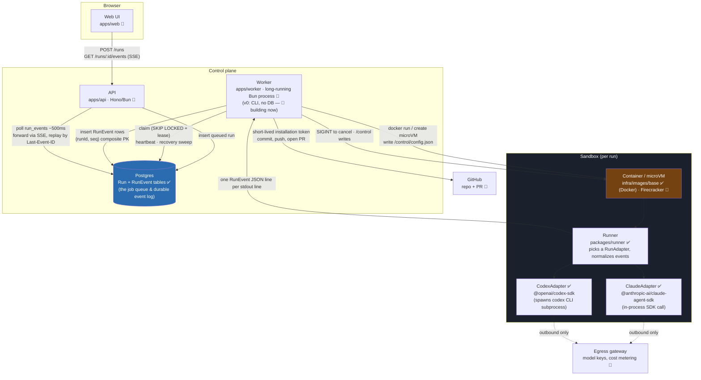
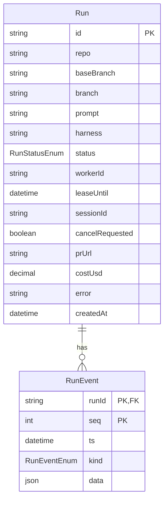

# Cloud Agents — Architecture

A hosted platform where a user signs in with GitHub, picks a repo, and hands a task to a coding
agent. The agent runs in an isolated sandbox in the cloud and keeps going after the user closes
their laptop. Output is a branch and a pull request. The platform is **harness-agnostic**: any
coding agent (Claude Code, Codex, Gemini CLI, and others) can run inside it, unmodified, behind
the same contracts.

Status legend used throughout: ✅ built & tested · 🚧 designed, not yet built.

---

## 1. Design principles

These are the decisions everything else in this document follows from.

1. **Harness-agnostic from day one.** Nothing outside the sandbox knows which coding agent is
   inside. This is enforced by two interfaces, not by convention: `RunAdapter` (inside the
   sandbox, one implementation per harness) and `Sandbox` (on the worker, one implementation per
   isolation backend). Adding a third harness or a second isolation backend should never require
   touching code that isn't that harness's or backend's own file.
2. **Postgres is the job queue.** `FOR UPDATE SKIP LOCKED` gives safe concurrent claiming without
   a separate broker. No Redis, no SQS, until it's *measured* to be insufficient — Postgres-as-queue
   is a well-worn pattern (Oban, River, GoodJob), not a shortcut.
3. **The sandbox is unreachable from the outside.** No browser, no API request, ever talks to a
   running container or microVM directly. Every hop goes through Postgres as a durable
   intermediary. This is what makes worker crashes non-catastrophic, and what keeps the sandbox's
   attack surface to one controlled egress path instead of an open inbound one.
4. **Docker now, Firecracker later.** Hardened Docker containers get the whole system working
   end-to-end first. A `Sandbox` interface means swapping in Firecracker microVMs (dedicated
   kernel, snapshot/restore, near-zero idle cost) later doesn't touch the worker's run-management
   logic.
5. **Backend first.** No web UI until the run lifecycle — queue, sandbox, event log, replay,
   crash recovery — is solid by hand-testing with `docker run` and a CLI worker.

---

## 2. System diagram



**Read this diagram as three planes:**

- **Client** — the only thing a user's browser ever talks to is the API, over plain HTTP and SSE.
- **Control plane** — API, worker, and Postgres. Postgres sits *between* API and worker; they
  never call each other directly. This is deliberate (see §4).
- **Sandbox** — one container (later: microVM) per run, fully isolated, reachable only by the
  worker, and with only one narrow outbound path (the egress gateway) back to the internet.

---

## 3. Run lifecycle (sequence)

```mermaid
sequenceDiagram
    actor User
    participant Browser
    participant API
    participant DB as Postgres
    participant Worker
    participant Sandbox as Container (Runner + Adapter)
    participant GH as GitHub

    User->>Browser: pick repo, type task
    Browser->>API: POST /runs
    API->>DB: insert Run (status=queued)
    API-->>Browser: run id

    loop poll (SKIP LOCKED)
        Worker->>DB: claim oldest queued run + lease
    end
    DB-->>Worker: claimed Run row

    Worker->>Worker: prepare workspace<br/>(bare mirror, worktree on agent/run-&lt;id&gt;)
    Worker->>Sandbox: docker run (uid 1000, resource limits)<br/>write /control/config.json
    Worker->>DB: status=running

    activate Sandbox
    Sandbox->>Sandbox: Runner selects RunAdapter (harness)
    loop agent turns
        Sandbox-->>Worker: RunEvent JSON line (stdout)
        Worker->>DB: insert RunEvent (runId, seq) skipDuplicates
    end
    Sandbox-->>Worker: kind=done (or error)
    deactivate Sandbox

    par live viewing
        Browser->>API: GET /runs/:id/events (SSE, Last-Event-ID)
        API->>DB: poll run_events WHERE seq > last (~500ms)
        DB-->>API: new RunEvent rows
        API-->>Browser: SSE events, id: seq
    end

    Worker->>DB: status=finalizing
    Worker->>Worker: run repo check command
    Worker->>GH: commit, push (short-lived installation token)
    Worker->>GH: open PR (check for existing PR first)
    Worker->>DB: status=succeeded, prUrl set
    API-->>Browser: SSE: kind=done
```

**Cancellation** follows the same DB-mediated path in reverse: `POST /runs/:id/cancel` sets
`cancelRequested` on the row → the worker (already polling/heartbeating that run) notices the flag
→ sends **SIGINT** (not SIGTERM — SIGTERM leaves the agent's turn unfinished) to the container →
the runner's signal handler calls the active adapter's `interrupt()`, which aborts the in-flight
SDK call or subprocess.

**Crash recovery**, every ~30s: the worker sweeps `running` rows with an expired lease, looks the
container up by its `run_id` label. Still running → take over, **re-read the container's stdout
log from the beginning** (this is why the runner prints *every* event to stdout rather than
streaming deltas — the whole history is always recoverable from the container's own log).
Exited → finalize normally. Gone entirely → requeue with `RESUME_SESSION` or mark failed.

---

## 4. Why Postgres sits between every hop

The single most load-bearing design choice in this system: **the browser never talks to the
sandbox, and the worker never talks to the API.** Every value crossing a boundary — a queued task,
a log line, a cancel request — is written to Postgres and read back out, never passed directly
between processes.

This buys three things at once:

- **Worker crashes are invisible to the browser.** The browser's `EventSource` just keeps polling
  `GET /runs/:id/events`; it has no idea whether the worker process that produced those rows is
  the one still running or a replacement that took over the lease five seconds ago.
- **Replay is free.** `RunEvent`'s composite primary key `(runId, seq)` plus `skipDuplicates: true`
  on insert means re-reading a container's full stdout history after a crash is *idempotent* — no
  special "resume from where I left off" logic needed, duplicates just no-op.
- **`EventSource` resume is free too.** The browser's native reconnect behavior resends
  `Last-Event-ID` automatically; the SSE endpoint just answers "everything with `seq >` that" from
  Postgres. No custom reconnect protocol was written for this — it's the platform default,
  because the durable log already existed for an unrelated reason (crash recovery).

## 5. Why SSE, not WebSockets

Explored directly with the user during development — see the reasoning transcript, summarized:

- The browser only ever needs data flowing **one direction** (server → browser). User actions
  (cancel, approve) are separate `POST` requests, not messages over the same channel — so the
  bidirectional half of a WebSocket buys nothing here.
- `EventSource`'s automatic reconnect-with-`Last-Event-ID` is exactly the resume primitive this
  system needs, built into the browser, for free. A WebSocket has no equivalent — reconnect/replay
  would have to be hand-rolled.
- SSE is plain HTTP. It survives proxies and load balancers that sometimes mishandle WebSocket
  upgrades, and `Bun.serve()` can stream it with no extra library.

## 6. Why Postgres as the job queue (not Redis/SQS)

`claim` is one `UPDATE ... WHERE id = (SELECT ... FOR UPDATE SKIP LOCKED LIMIT 1) RETURNING *`
statement. Multiple worker processes can run this concurrently against the same table with no
double-claim race, no separate broker to operate, and no second source of truth to keep in sync
with the `Run` row it's already reading. This is a deliberately deferred optimization decision —
"no Redis until it's measured to be needed" — not an unawareness of message brokers.

## 7. Harness-agnostic in practice

Built and tested so far: two adapters, structurally as different from each other as any future
third harness is likely to be, both satisfying the exact same `RunAdapter` interface
(`packages/runner/src/adapter.ts`):

```mermaid
classDiagram
    class RunAdapter {
        <<interface>>
        +start(task, resume?) AsyncIterable~RunEvent~
        +interrupt() Promise~void~
    }
    class ClaudeAdapter {
        -controller: AbortController
        +start()
        +interrupt()
    }
    class CodexAdapter {
        -controller: AbortController
        +start()
        +interrupt()
    }
    RunAdapter <|.. ClaudeAdapter
    RunAdapter <|.. CodexAdapter
    ClaudeAdapter --> "@anthropic-ai/claude-agent-sdk" : in-process query()
    CodexAdapter --> "@openai/codex-sdk" : spawns codex CLI subprocess
```

- `ClaudeAdapter` calls `@anthropic-ai/claude-agent-sdk`'s `query()` **in-process** — a TypeScript
  async generator, no subprocess involved.
- `CodexAdapter` uses `@openai/codex-sdk`, which itself **spawns the `codex` CLI as a subprocess**
  and exchanges JSONL events over stdout — an entirely different transport.

Both get mapped, by a pure function per adapter (`mapClaudeMessage`, `mapCodexEvent` — both
`bun test`-covered with fixture data, no live calls needed to verify the mapping logic), onto the
same normalized `RunEvent` shape from `packages/shared`:

```
kind: status | text | tool_call | tool_result | raw | error | done
```

Nothing downstream of the runner — not the worker, not the API, not the UI — ever needs to know
whether a given run is Claude Code or Codex under the hood.

## 8. Security boundaries

- **No credentials enter the sandbox.** The worker does all git operations (commit, push, PR)
  itself using short-lived GitHub App installation tokens, from the host, outside the container.
  The runner's own tool policy additionally disallows `Bash(git push *)` as a second layer.
- **Non-root by construction.** The base image runs as uid 1000 (`infra/images/base/Dockerfile`,
  built on the official Node image's built-in `node` user), and the worker launches every
  container with `--user 1000:1000` explicitly regardless.
- **One-way egress only.** The sandbox's outbound network goes through an egress gateway (later:
  a LiteLLM gateway that also injects model keys and meters per-run cost). Nothing external has an
  inbound path to a running sandbox — not the browser, not any other host.
- **Only the worker touches the Docker socket** — effectively root on the host, so it's the one
  process with that privilege, not the API, not anything reachable from the browser.
- **A repo's own `.mcp.json`/`.claude/settings.json` are untrusted by default** — `strict_mcp_config`
  and explicit `setting_sources` prevent a malicious repo from smuggling in hooks or MCP servers
  the platform didn't choose.
- **Invite-only** while the Docker backend is the only isolation option; public sign-up is gated
  behind the microVM backend landing first.

## 9. Data model



`RunEvent`'s primary key is the **composite** `(runId, seq)` — not an auto-increment id. That
single choice is what makes crash-recovery replay idempotent: re-inserting an event the worker
already wrote (because it re-read the container's stdout log after taking over a lease) just
violates the PK / gets skipped by `skipDuplicates: true`, instead of creating a duplicate row.

## 10. Component status

| Component | Location | Status |
|---|---|---|
| Zod contracts (`RunEvent`, `RunStatus`, `HarnessManifest`) | `packages/shared` | ✅ |
| Prisma schema, migration, singleton client | `packages/db` | ✅ |
| Base sandbox image (Debian, non-root uid 1000, bun/git/python3) | `infra/images/base` | ✅ |
| `RunAdapter` interface | `packages/runner/src/adapter.ts` | ✅ |
| Claude Code adapter | `packages/runner/src/adapters/claude.ts` | ✅ tested live |
| Codex adapter | `packages/runner/src/adapters/codex.ts` | ✅ tested live |
| Runner entrypoint (config load, harness selection, stdout printing) | `packages/runner/src/index.ts` | ✅ tested live in-container |
| Worker v0 (no DB, `Bun.spawn` docker run, commit, print diff) | `apps/worker` | 🚧 in progress |
| DB-backed worker (claim/lease/heartbeat/cancel/recovery sweep) | `apps/worker` | 🚧 planned |
| API (POST/GET runs, cancel, SSE with replay) | `apps/api` | 🚧 planned |
| Web UI | `apps/web` | 🚧 planned |
| GitHub App (auth, installations, mirror, worktree, push, PR) | — | 🚧 planned |
| ACP adapter (Gemini CLI and others) | `packages/runner` | 🚧 planned |
| Environments (recipes, cached images, MCP config, model gateway) | — | 🚧 planned |
| Jev supervisor (risky-action gate, stuck/progressing/done check) | — | 🚧 planned |
| Firecracker microVM backend | — | 🚧 planned |

---

*Diagrams are Mermaid — render natively on GitHub, GitLab, and in most editors (VS Code with the
"Markdown Preview Mermaid Support" extension, or built-in in newer versions).*
